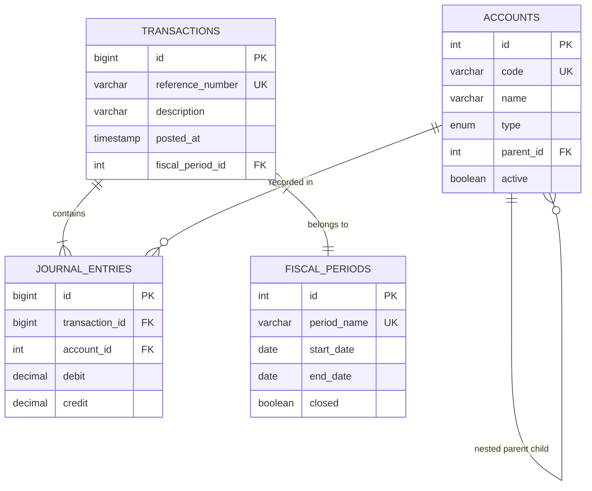

# LedgerDB: High-Performance Double-Entry Financial Ledger Engine

LedgerDB is a database engine designed for financial technology (FinTech) systems. It models a production-grade double-entry bookkeeping system in MySQL 8.0+, prioritizing data integrity, immutability, auditability, and optimized query structures.

Rather than using basic and error-prone `balance` columns, LedgerDB records transactions using debits and credits that balance to zero, preserving an audit trail of every financial movement.

---

## Technical Highlights
* **Immutability Triggers**: Strict trigger enforcement prevents `UPDATE` or `DELETE` operations on transactions and journal entries, ensuring historical audit trails can never be falsified.
* **Hierarchical Chart of Accounts**: Implements recursive queries (Common Table Expressions) to dynamically roll up balances from nested child accounts (e.g., *Cash Checking* -> *Cash & Cash Equivalents* -> *Assets*).
* **JSON Payload Ingestion**: Utilizes MySQL's native JSON parser (`JSON_TABLE`) in stored procedures to ingest multi-entry transactions atomically in a single query.
* **Fiscal Period Safeties**: Rejects transactions placed outside active or closed accounting ranges via date range and state validation.
* **Advanced Analytics**: Employs window functions to compute running ledger balances and calculate month-over-month SaaS revenue growth rates.
* **Optimized Indexing**: Features covering indexes and compound range keys engineered to resolve complex reporting joins with sub-millisecond latency.

---

## Database Architecture (ERD)



---

## File Structure

* **`schema.sql`**: Core DDL containing the tables, relationships, constraints, and safety triggers.
* **`seed.sql`**: Realistic transactional database seeding representing standard business cycles.
* **`procedures.sql`**: JSON-based transaction processing and fiscal period closing controllers.
* **`views.sql`**: Database reporting layer for Trial Balance, Balance Sheet, and Income Statement generation.
* **`indexes.sql`**: Custom composite and covering indexes targeting performance bottlenecks.
* **`queries.sql`**: Advanced SQL queries executing recursive CTE rollups, window function ledger statements, and growth analytics.

---

## Setup & Deployment Guide

Execute the files in the following order to construct the database schema, seed data, and functional dependencies:

```bash
# Connect to your MySQL server and run:
mysql -u your_user -p < schema.sql
mysql -u your_user -p < seed.sql
mysql -u your_user -p < procedures.sql
mysql -u your_user -p < views.sql
mysql -u your_user -p < indexes.sql
```

---

## Operational Demos

### 1. Recording a Transaction (JSON Array Injection)
Use the JSON-based stored procedure `sp_create_transaction` to atomically record a multi-entry transaction. Below, we record a SaaS server payment (Debit Cloud Infrastructure Expense, Credit Cash) totaling $300.00:

```sql
CALL sp_create_transaction(
    'TX-1013',                                     -- Reference code
    'AWS Cloud Service Billing - May',             -- Description
    '2026-05-15 12:00:00',                         -- Posting timestamp
    2,                                             -- Fiscal Period ID (FP-2026-Q2)
    '[
        {"account_id": 17, "debit": 300.00, "credit": 0.00},
        {"account_id": 6, "debit": 0.00, "credit": 300.00}
    ]'                                             -- Entries array
);
```

### 2. Transaction Safety Validation (Immutability Demo)
Verify the safety triggers prevent tampering with posted records. Executing the following query will trigger an SQL error:

```sql
-- This operation will fail with: "Financial records are immutable. Journal entry updates are forbidden."
UPDATE journal_entries 
SET debit = 1000.00 
WHERE id = 1;
```

### 3. Out-of-Balance Rejection Demo
Verify the stored procedure rejects transactions that violate the double-entry accounting principle:

```sql
-- This will fail with: "Transaction out-of-balance: Total Debits must equal Total Credits."
CALL sp_create_transaction(
    'TX-FAIL-1',
    'Unbalanced entry test',
    '2026-05-15 12:00:00',
    2,
    '[
        {"account_id": 17, "debit": 500.00, "credit": 0.00},
        {"account_id": 6, "debit": 0.00, "credit": 400.00}
    ]'
);
```

### 4. Running Ledger Statement Demo
Extract a complete running ledger of the Cash Account showing debits, credits, and the calculated balance over time (uses MySQL Window Functions):

```sql
SELECT 
    t.posted_at,
    t.description,
    je.debit,
    je.credit,
    SUM(je.debit - je.credit) OVER (
        PARTITION BY je.account_id 
        ORDER BY t.posted_at, t.id
        ROWS BETWEEN UNBOUNDED PRECEDING AND CURRENT ROW
    ) AS running_balance
FROM journal_entries je
JOIN transactions t ON je.transaction_id = t.id
WHERE je.account_id = 6 -- Cash Account ID
ORDER BY t.posted_at, t.id;
```
